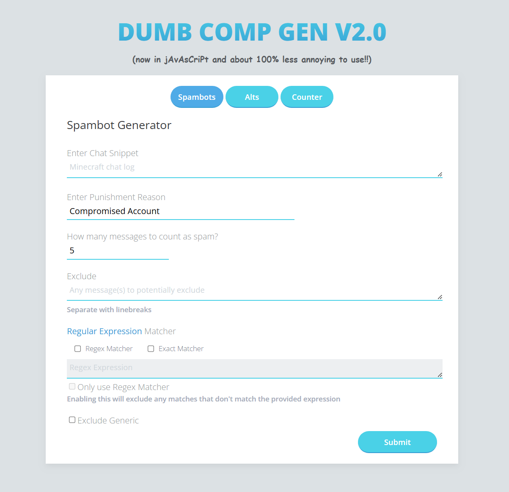

# Minecraft Command Generator Utility

I wrote this in 2019. The purpose of this thing was to generate a list of copy-pastable chat commands based on text snippets output from another tool.

Sharing this publicly now for visibility, because I own everything related to this.